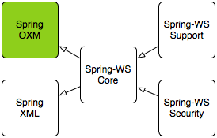

# Spring Web Service Reference Document

在当前的面向服务的体系结构时代，越来越多的人正在使用WS来连接以前未连接的系统。最初，Web服务被认为是进行远程过程调用（RPC）的另一种方式。 但是随着时间的推移，人们发现RPC和Web服务之间存在很大的差异。尤其是当与其他平台的互操作性很重要时，发送封装的XML文档通常会更好，其中包含处理请求所需的所有数据。 从概念上讲，基于XML的Web服务比消息队列而不是远程解决方案更好。 总的来说，XML应该被认为是数据的平台中立表示，这是SOA的**国际语言**。 在开发或使用Web服务时，重点应放在这个XML上，而不是Java上。

Spring Web Services着重于创建这些文档驱动的Web服务。 Spring Web Services促进了契约优先的SOAP服务开发，允许使用多种方式来操作XML有效载荷，从而创建灵活的Web服务。 Spring-WS提供了强大的消息契约[分派框架](https://www.gitbook.com/book/lyfuci/spring-web-services/edit#)，与现有应用程序安全解决方案集成的[WS-Security](https://www.gitbook.com/book/lyfuci/spring-web-services/edit#)解决方案，以及遵循熟悉的Spring模板模式的[客户端API](https://www.gitbook.com/book/lyfuci/spring-web-services/edit#)。

### 一、简介

参考文档的第一部分是Spring Web服务及其基本概念的[概述](https://docs.spring.io/spring-ws/docs/3.0.0.RELEASE/reference/#what-is-spring-ws)。 然后介绍了并解释了契约优先Web服务开发背后的概念。

#### 1. 什么是Spring web Service？

##### 1.1 简介

Spring Web服务（Spring-WS）是Spring社区致力于创建文档驱动的Web服务的产物。Spring Web Services旨在促进契约优先（contract-first）的SOAP服务开发，允许使用多种方法之一来创建灵活的Web服务来操作XML有效载荷。 该产品基于Spring本身，这意味着可以将Spring概念（如依赖注入）用作Web服务的组成部分。

人们使用Spring-WS的原因有很多，但是大多数人在找到替代的SOAP堆栈之后，大多数都是在遵循Web服务最佳实践的时候才使用它。 Spring-WS使最佳实践变得简单实践。 这包括WS-I的基本概况，Contract-First开发以及契约和实施之间的松散耦合等实践。 Spring Web服务的其他主要特性是：

###### 1.1.1 强大的映射能力

您可以将传入的XML请求分发给任何对象，具体取决于消息有效负载，SOAP Action标头或XPath表达式。

###### 1.1.2 XML API 支持

传入的XML消息不仅可以使用标准JAXP API（如DOM，SAX和StAX），还可以使用JDOM，dom4j，XOM甚至编组技术进行处理。

###### 1.1.3 灵活的XML编组（Marshalling）

Spring Web Services建立在Spring Framework的Object / XML Mapping模块上，它支持JAXB 1和2，Castor，XMLBeans，JiBX和XStream。

###### 1.1.4 Spring专业知识重用

Spring-WS使用Spring应用程序上下文进行所有配置，这有助于Spring开发人员快速正确的上手。并且，Spring-WS的体系结构类似于Spring-MVC的体系结构。

###### 1.1.5 支持 Supports WS-Security

WS-Security允许您发布（sign）SOAP消息，对其进行加密和解密，或者对其进行身份验证。

###### 1.1.6 和Spring Security进行集成

Spring Web服务的WS-Security实现提供了与Spring Security的集成。 这意味着你也可以使用你现有的Spring Security配置。

###### 1.1.7 Apache license

You can confidently use Spring-WS in your project.

##### 1.2 运行环境

Spring Web Services需要一个标准的Java 7或者Java 8运行时环境。 Spring-WS基于Spring Framework 4.0.9，也支持更高版本。

Spring-WS由多个模块组成，在本节的其余部分中将对其进行介绍。

* XML模块（spring-xml.jar）包含Spring Web Services的各种XML支持类。 这个模块主要侧重于Spring-WS框架本身，而不是Web服务开发。
* 核心模块（spring-ws-core.jar）是Spring Web Service功能的核心部分。 它提供了服务器端框架最中心的WebServiceMessage和SoapMessage接口，这两个接口拥有强大的消息分派功能，并且提供了用于实现Web服务端点（endpoints）的各种支持类; 在客户端方面，中心接口则是WebServiceTemplate。
* 支持模块（spring-ws-support.jar），包含额外的传输功能（JMS，电子邮件等）。
* 安全包（spring-ws-security.jar）提供了与核心Web服务包集成的WS-Security实现。 它允许您添加主体令牌（principal token），签名（sign），解密和加密SOAP消息。 此外，它还允许您利用现有Spring Security的安全性实现进行身份验证和授权。

下图说明了Spring-WS模块以及它们之间的依赖关系。 箭头表示依赖关系，即Spring-WS Core依赖于Spring-XML和Spring 3及更高版本中的OXM模块。



##### 1.3 支持的标准

Spring Web Services支持以下标准：

- SOAP 1.1 and 1.2
- WSDL 1.1 and 2.0 (XSD-based generation only supported for WSDL 1.1)
- WS-I Basic Profile 1.0, 1.1, 1.2 and 2.0
- WS-Addressing 1.0 and the August 2004 draft
- SOAP Message Security 1.1, Username Token Profile 1.1, X.509 Certificate Token Profile 1.1, SAML Token Profile 1.1, Kerberos Token Profile 1.1, Basic Security Profile 1.1

####  2. 为什么契约（contract）优先

##### 2.1 简介

创建Web服务时，有两种开发风格：契约优先和契约最后。 在使用契约最后的方法时，首先从Java代码开始，然后让Web Service合约（WSDL）从java代码中生成。 当使用契约优先的风格时，您从WSDL开始，并使用Java来执行实现所述契约。

> WSDL代表Web Service描述语言。 WSDL文件是描述Web服务的XML文档。 它指定了服务的位置以及服务公开的操作（或方法）。 有关WSDL的更多信息，请参阅 [WSDL specification](https://www.w3.org/TR/wsdl)。

Spring-WS只支持契约优先的开发风格，本节解释其原因。

##### 2.2 Object/XML 阻抗不匹配（Impedance Mismatch）

与ORM的字段相似，我们有一个[对象/关系阻抗不匹配](https://en.wikipedia.org/wiki/Object-Relational_impedance_mismatch)，在将Java对象转换为XML时存在类似的问题。 乍一看，O / X映射问题看起来很简单：为每个Java对象创建一个XML元素，将所有Java属性和字段转换为子元素或属性。 然而事情并不像看起来那么简单：XML（尤其是XSD）等分层语言与Java的图形模型之间存在根本的区别。

###### 2.2.1 XSD extensions

在Java中，更改类行为的唯一方法是继承该类，并将新行为添加到其子类中。 在XSD中，可以通过限制数据类型来扩展数据类型：即限制元素和属性的有效值。 例如，考虑下面的例子：

```xml
<simpleType name="AirportCode">
	<restriction base="string">
		<pattern value="[A-Z][A-Z][A-Z]"/>
	</restriction>
</simpleType>
```
这里限制了一个XSD的String类型，只允许三个大写字母。如果这个类型转换为Java，我们将以普通的 *java.lang.String* 结束; 正则表达式在转换过程中丢失了，因为Java不允许这种扩展。

###### 2.2.2 类型不可移植

Web服务最重要的目标之一是可以互操作的：支持Java，.NET，Python等多种平台。因为所有这些语言都有不同的类库，所以你必须使用一些通用的语言间格式来进行通信 它们之间。 这种格式是XML，所有这些语言都支持这种格式。

由于这种转换，您必须确保在服务实现中使用便携式类型。 例如，考虑一个返回 java.util.TreeMap 的服务，如下所示：
```
public Map getFlights() {  // use a tree map, to make sure it's sorted  	TreeMap map = new TreeMap(); 
	map.put("KL1117", "Stockholm"); 
	return map;
}
```

毫无疑问，这个映射的内容可以转换成某种类型的XML，但是由于在XML中没有**标准**的方式来描述映射，所以它是专有的。 另外，即使可以将其转换为XML，许多平台也没有类似于TreeMap的数据结构。 所以当一个.NET客户端访问你的Web服务时，它可能最终会解析为一个System.Collections.Hashtable，这让它具有不同的语义。

在客户端工作时也存在此问题。 考虑下面的XSD片段，它描述了一个服务合约：

```xml
<element name="GetFlightsRequest">
  <complexType>
    <all>
      <element name="departureDate" type="date"/>
      <element name="from" type="string"/>
      <element name="to" type="string"/>
    </all>
  </complexType>
</element>
```

该合同定义了一个请求，该请求采用日期，该日期是表示年，月和日的XSD数据类型。 如果我们从Java调用这个服务，我们可能会使用`java.util.Date`或`java.util.Calendar`。 然而，这两个类实际上是描述时间，而不是日期。 因此，我们实际上最终会发送代表2007年4月4日午夜（`2007-04-04T00：00：00`）的数据，这与`2007-04-04`不一样。

###### 2.2.3 循环图（Cyclic graphs）

假设我们有以下的类结构：

```java
public class Flight {
  private String number;
  private List<Passenger> passengers;

  // getters and setters omitted
}

public class Passenger {
  private String name;
  private Flight flight;

  // getters and setters omitted
}
```

这是一个循环图：`Flight`指向`Passenger`，`Passenger`引用`Flight`。 像Java这样的循环图在Java中很常见。 如果我们采取一种天真的方式将其转换为XML，我们最终会得到如下结果：

```xml
<flight number="KL1117">
  <passengers>
    <passenger>
      <name>Arjen Poutsma</name>
      <flight number="KL1117">
        <passengers>
          <passenger>
            <name>Arjen Poutsma</name>
            <flight number="KL1117">
              <passengers>
                <passenger>
                   <name>Arjen Poutsma</name>
                   ...
```

这将需要相当长的时间才能完成，因为这个循环没有停止条件。

解决这个问题的一个方法是使用已经编组的对象的引用，如下所示：

```xml
<flight number="KL1117">
  <passengers>
    <passenger>
      <name>Arjen Poutsma</name>
      <flight href="KL1117" />
    </passenger>
    ...
  </passengers>
</flight>
```

这解决了递归问题，但引入了新的问题。 首先，你不能使用XML验证器来验证这个结构。 另一个问题是，在SOAP（RPC /encoded）中使用这些引用的标准方式已被弃用，以支持document/literal （请参阅WS-I基本[配置文件](http://www.ws-i.org/Profiles/BasicProfile-1.1.html#SOAP_encodingStyle_Attribute)）。

这些只是处理O / X映射时的几个问题。 编写Web服务时要尊重这些问题。 尊重它们的最好方式是将Java作为一种实现语言，而完全专注于XML。 这才是契约第一。

##### 2.3 契约优先VS契约最后

除了上一节提到的对象/ XML映射问题外，还有一些优先采用契约优先开发风格的原因。

###### 2.3.1 脆弱

如前所述，契约最后的开发风格导致您的Web服务契约（WSDL和您的XSD）是从您的Java（通常是一个接口）生成的。 如果你使用这种方法，你将不能保证约定保持不变。 每次更改Java并重新部署时，可能会对Web服务契约进行更改。

另外，并不是所有的SOAP堆栈都会从Java合约生成相同的Web服务合约。 这意味着改变你的当前SOAP堆栈（不管是什么原因），也可能会改变你的Web服务契约。

当一个Web服务契约发生变化时，契约用户必须被指示获得新的契约，并且可能改变他们的代码以适应契约的任何变化。

为了使契约有用，它必须尽可能保持不变。 如果契约发生变化，您必须联系您的服务的所有用户，并指示他们获得新版本的契约。

###### 2.3.2 性能

当Java自动转换为XML时，无法确定通过线路发送的内容。 一个对象可能引用另一个对象，引用另一个对象等。最后，虚拟机堆中的一半对象可能会转换为XML，这会导致响应时间变慢。

当使用契约优先，你明确地描述了什么地方发送的XML，从而确保它正是你想要的。

###### 2.3.3. 可重用性

在一个单独的文件中定义模式允许您在不同的场景中重用该文件。 如果您在名为`airline.xsd`的文件中定义一个`AirportCode`，如下所示：

```xml
<simpleType name="AirportCode">
    <restriction base="string">
        <pattern value="[A-Z][A-Z][A-Z]"/>
    </restriction>
</simpleType>
```

您可以使用import语句在其他模式，甚至WSDL文件中重复使用此定义。

###### 2.3.4 版本

尽管契约必须尽可能保持不变，但有时候也**确实**需要改变。 在Java中，这通常会导致一个新的Java接口，如`AirlineService2`，以及该接口的一个（新）实现。 当然，旧服务必须保留，因为可能还有客户还没有迁移。

如果使用契约优先，我们可以在契约和执行之间有一个宽松的耦合。 这种宽松的耦合使我们能够在一个类中实现两个版本的合同。 例如，我们可以使用XSLT样式表将任何“老”消息转换为“新”消息。

#### 3 编写契约优先的Web Service

##### 3.1 简介 

本教程将向您展示如何编写[契约优先的Web服务](https://docs.spring.io/spring-ws/docs/3.0.0.RELEASE/reference/#why-contract-first)，也就是开发以XML Schema / WSDL契约开始，随后是Java代码开始的Web服务。 Spring-WS侧重于这种开发风格，本教程将帮助您开始。 请注意，本教程的第一部分几乎没有包含Spring-WS特定信息：它主要是关于XML，XSD和WSDL。 [第二部分](https://docs.spring.io/spring-ws/docs/3.0.0.RELEASE/reference/#tutorial-creating-project)着重于使用Spring-WS实现这个契约。

做契约优先的Web服务开发时最重要的事情就是尝试用XML来思考。 这意味着Java语言的概念不太重要。 您应该专注于通过电线发送的XML。 实现细节仍然是Java被用来实现Web服务的事实。

##### 3.2 消息

在本节中，我们将重点讨论发送到Web服务和从Web服务发送的实际XML消息。 我们将首先确定这些消息是什么样子的。

###### 3.2.1 Holiday

在这种情况下，我们必须处理`Holiday`请求，因此确定XML在假期中的样子是有意义的：

```xml
<Holiday xmlns="http://mycompany.com/hr/schemas">
    <StartDate>2006-07-03</StartDate>
    <EndDate>2006-07-07</EndDate>
</Holiday>
```

A holiday 由开始日期和结束日期组成。 我们还决定在日期中使用标准的[ISO 8601](https://www.cl.cam.ac.uk/~mgk25/iso-time.html)日期格式，因为这样可以节省很多分析的麻烦。 我们还为元素添加了一个名称空间，以确保我们的元素可以在其他XML文档中使用。

###### 3.2.2 Employee

在这种情况下，也有员工的概念。 这里是它在XML中的样子：

```xml
<Employee xmlns="http://mycompany.com/hr/schemas">
    <Number>42</Number>
    <FirstName>Arjen</FirstName>
    <LastName>Poutsma</LastName>
</Employee>
```

我们已经使用了和以前一样的命名空间。 如果`<Employee />`元素可以在其他场景中使用，则可以使用不同的名称空间，比如http://mycompany.com/employees/schemas。

###### 3.2.3 HolidayRequest

`holiday`和`employee`元素都可以放在`<HolidayRequest />`中：

```xml
<HolidayRequest xmlns="http://mycompany.com/hr/schemas">
    <Holiday>
        <StartDate>2006-07-03</StartDate>
        <EndDate>2006-07-07</EndDate>
    </Holiday>
    <Employee>
        <Number>42</Number>
        <FirstName>Arjen</FirstName>
        <LastName>Poutsma</LastName>
    </Employee>
</HolidayRequest>
```

这两个元素的顺序并不重要：<Employee />也可以是第一个元素。 重要的是所有的数据都在那里。 事实上，数据是唯一重要的东西：我们正在采取**数据驱动**的方法。

##### 3.3 Data Contract

现在我们已经看到了一些我们将要使用的XML数据的例子，把它形式化为一个模式是有意义的。 这个数据契约定义了我们接受的消息格式。 定义这种XML合同有四种不同的方式：

* DTDs
* [XML Schema (XSD)](https://www.w3.org/XML/Schema)
* [RELAX NG](http://www.relaxng.org/)
* [Schematron](http://www.schematron.com/)


DTD具有有限的名称空间支持，所以它们不适合Web服务。 RELAX NG和Schematron肯定比XML Schema容易。 不幸的是，它们并没有得到如此广泛的平台支持。 我们将使用XML Schema。

到目前为止，创建XSD最简单的方法是从示例文档中推断出来。 任何好的XML编辑器或Java IDE都可以提供这种功能。 基本上，这些工具使用一些示例XML文档，并从中生成一个模式来验证它们。 最终的结果肯定需要打磨，但这是一个很好的起点。

使用上面描述的示例，我们得到了以下生成的schema：

```xml
<xs:schema xmlns:xs="http://www.w3.org/2001/XMLSchema"
		elementFormDefault="qualified"
      targetNamespace="http://mycompany.com/hr/schemas"
        xmlns:hr="http://mycompany.com/hr/schemas">
    <xs:element name="HolidayRequest">
        <xs:complexType>
            <xs:sequence>
                <xs:element ref="hr:Holiday"/>
                <xs:element ref="hr:Employee"/>
            </xs:sequence>
        </xs:complexType>
    </xs:element>
    <xs:element name="Holiday">
        <xs:complexType>
            <xs:sequence>
                <xs:element ref="hr:StartDate"/>
                <xs:element ref="hr:EndDate"/>
            </xs:sequence>
        </xs:complexType>
    </xs:element>
    <xs:element name="StartDate" type="xs:NMTOKEN"/>
    <xs:element name="EndDate" type="xs:NMTOKEN"/>
    <xs:element name="Employee">
        <xs:complexType>
            <xs:sequence>
                <xs:element ref="hr:Number"/>
                <xs:element ref="hr:FirstName"/>
                <xs:element ref="hr:LastName"/>
            </xs:sequence>
        </xs:complexType>
    </xs:element>
    <xs:element name="Number" type="xs:integer"/>
    <xs:element name="FirstName" type="xs:NCName"/>
    <xs:element name="LastName" type="xs:NCName"/>
</xs:schema>
```
这个生成的schema显然可以改进。 首先要注意的是每种类型都有一个根级元素声明。 这意味着Web服务应该能够接受所有这些元素作为数据。 这是不可取的：我们只想接受`<HolidayRequest />`。 通过去除包裹元素标签（从而保持类型），并将结果内联，我们可以做到这一点。

```xml
<xs:schema xmlns:xs="http://www.w3.org/2001/XMLSchema"
        xmlns:hr="http://mycompany.com/hr/schemas"
        elementFormDefault="qualified"
        targetNamespace="http://mycompany.com/hr/schemas">
    <xs:element name="HolidayRequest">
        <xs:complexType>
            <xs:sequence>
                <xs:element name="Holiday" type="hr:HolidayType"/>
                <xs:element name="Employee" type="hr:EmployeeType"/>
            </xs:sequence>
        </xs:complexType>
    </xs:element>
    <xs:complexType name="HolidayType">
        <xs:sequence>
            <xs:element name="StartDate" type="xs:NMTOKEN"/>
            <xs:element name="EndDate" type="xs:NMTOKEN"/>
        </xs:sequence>
    </xs:complexType>
    <xs:complexType name="EmployeeType">
        <xs:sequence>
            <xs:element name="Number" type="xs:integer"/>
            <xs:element name="FirstName" type="xs:NCName"/>
            <xs:element name="LastName" type="xs:NCName"/>
        </xs:sequence>
    </xs:complexType>
</xs:schema>
```

该模式仍然有一个问题：像这样的模式，您可以期望以下消息进行验证：

```xml
<HolidayRequest xmlns="http://mycompany.com/hr/schemas">
    <Holiday>
        <StartDate>this is not a date</StartDate>
        <EndDate>neither is this</EndDate>
    </Holiday>
    PlainText Section qName:lineannotation level:4, chunks:[<, !-- ... --, >] attrs:[:]
</HolidayRequest>
```

显然，我们必须确保开始日期和结束日期真的是日期。 XML Schema有一个很好的内置日期类型供我们使用。 我们也把NCName改成字符串s。 最后，我们将`<HolidayRequest />`中的序列更改为all。 这告诉XML解析器，`<Holiday />`和`<Employee />`的顺序不重要。 我们的最终XSD现在看起来像这样：

```xml
<xs:schema xmlns:xs="http://www.w3.org/2001/XMLSchema"
        xmlns:hr="http://mycompany.com/hr/schemas"
        elementFormDefault="qualified"
        targetNamespace="http://mycompany.com/hr/schemas">
    <xs:element name="HolidayRequest">
        <xs:complexType>
            <xs:all>
                <xs:element name="Holiday" type="hr:HolidayType"/> 
                <xs:element name="Employee" type="hr:EmployeeType"/> 
            </xs:all>
        </xs:complexType>
    </xs:element>
    <xs:complexType name="HolidayType">
        <xs:sequence>
            <xs:element name="StartDate" type="xs:date"/> 
            <xs:element name="EndDate" type="xs:date"/> 
        </xs:sequence>
    </xs:complexType>
    <xs:complexType name="EmployeeType">
        <xs:sequence>
            <xs:element name="Number" type="xs:integer"/>
            <xs:element name="FirstName" type="xs:string"/> 
            <xs:element name="LastName" type="xs:string"/> 
        </xs:sequence>
    </xs:complexType>
</xs:schema>
```

* `all`告诉XML解析器，`<Holiday />`和`<Employee />`的顺序不重要。
* 对于`<StartDate />`和`<EndDate />`，我们使用`xs：date`数据类型，包括年，月和日。
* `xs：string`用于LastName和FirstName。

我们将上面这个文件存储到hr.xsd.

##### 3.4 Service contract

服务契约通常表示为[WSDL](https://www.w3.org/TR/wsdl)文件。 请注意，在Spring-WS中，手动编写WSDL不是必需的。 基于XSD和一些约定，Spring-WS可以为您创建WSDL，如“[实现mj端点](https://docs.spring.io/spring-ws/docs/3.0.0.RELEASE/reference/#tutorial.implementing.endpoint)”一节中所述。 如果你愿意，你可以跳到[下一节](https://docs.spring.io/spring-ws/docs/3.0.0.RELEASE/reference/#tutorial-creating-project)。 本节的其余部分将向您展示如何手动编写自己的WSDL。

我们用标准序言开始我们的WSDL，并导入我们现有的XSD。 为了从定义中分离模式，我们将为WSDL定义使用单独的名称空间：http://mycompany.com/hr/definitions。
```xml
<wsdl:definitions xmlns:wsdl="http://schemas.xmlsoap.org/wsdl/"
              xmlns:soap="http://schemas.xmlsoap.org/wsdl/soap/"
              xmlns:schema="http://mycompany.com/hr/schemas"
              xmlns:tns="http://mycompany.com/hr/definitions"
              targetNamespace="http://mycompany.com/hr/definitions">
<wsdl:types>
    <xsd:schema xmlns:xsd="http://www.w3.org/2001/XMLSchema">
        <xsd:import namespace="http://mycompany.com/hr/schemas" schemaLocation="hr.xsd"/>
    </xsd:schema>
</wsdl:types>
```
接下来，我们根据写入的模式类型添加我们的消息。 我们只有一个消息：一个与`<HolidayRequest />`我们放在架构：

```xml
   <wsdl:message name="HolidayRequest">
        <wsdl:part element="schema:HolidayRequest" name="HolidayRequest"/>
    </wsdl:message>
```

我们将消息添加到端口类型作为操作：

```xml
  <wsdl:portType name="HumanResource">
        <wsdl:operation name="Holiday">
            <wsdl:input message="tns:HolidayRequest" name="HolidayRequest"/>
        </wsdl:operation>
    </wsdl:portType>
```

这完成了WSDL的抽象部分（接口，原来是这样），并离开了具体部分。 具体部分由一个`binding`组成，它告诉客户**如何**调用你刚刚定义的操作; 和一个`service`，告诉它在哪里调用它。

添加一个具体的部分是非常标准的：只要引用您之前定义的抽象部分，确保您使用`soap：binding`元素（`rpc / encoded`已弃用）的**document / literal**，为操作选择一个`soapAction`（在这种情况下为http://mycompany.com/RequestHoliday，但任何URI都可以），并确定你想要请求的`location`URL（在这个例子中是http://mycompany.com/humanresources）：

```xml
<wsdl:definitions xmlns:wsdl="http://schemas.xmlsoap.org/wsdl/"
                  xmlns:soap="http://schemas.xmlsoap.org/wsdl/soap/"
                  xmlns:schema="http://mycompany.com/hr/schemas"
                  xmlns:tns="http://mycompany.com/hr/definitions"
                  targetNamespace="http://mycompany.com/hr/definitions">
    <wsdl:types>
        <xsd:schema xmlns:xsd="http://www.w3.org/2001/XMLSchema">
            <xsd:import namespace="http://mycompany.com/hr/schemas"              
                schemaLocation="hr.xsd"/>
        </xsd:schema>
    </wsdl:types>
    <wsdl:message name="HolidayRequest">                                         
        <wsdl:part element="schema:HolidayRequest" name="HolidayRequest"/>       
    </wsdl:message>
    <wsdl:portType name="HumanResource">                                         
        <wsdl:operation name="Holiday">
            <wsdl:input message="tns:HolidayRequest" name="HolidayRequest"/>     
        </wsdl:operation>
    </wsdl:portType>
    <wsdl:binding name="HumanResourceBinding" type="tns:HumanResource">          
        <soap:binding style="document"                                           
            transport="http://schemas.xmlsoap.org/soap/http"/>                   
        <wsdl:operation name="Holiday">
            <soap:operation soapAction="http://mycompany.com/RequestHoliday"/>   
            <wsdl:input name="HolidayRequest">
                <soap:body use="literal"/>                                       
            </wsdl:input>
        </wsdl:operation>
    </wsdl:binding>
    <wsdl:service name="HumanResourceService">
        <wsdl:port binding="tns:HumanResourceBinding" name="HumanResourcePort">  
            <soap:address location="http://localhost:8080/holidayService/"/>     
        </wsdl:port>
    </wsdl:service>
</wsdl:definitions>
```

1. 我们导入[Data Contract](https://docs.spring.io/spring-ws/docs/3.0.0.RELEASE/reference/#tutorial.xsd)中定义的模式。
2. 我们定义了在`PortType`中使用的`HolidayRequest`消息。
3. `HolidayRequest`类型在`schema`中定义了。
4. 我们定义`HumanResource`端口类型，它在`binding`中使用。
5. 我们定义了在端口中使用的`HumanResourceBinding`绑定。
6. 我们使用了 document/literal 风格.
7. literal 的http://schemas.xmlsoap.org/soap/http表示一个HTTP传输。
8. `soapAction`属性表示将随每个请求一起发送的`SOAPAction` HTTP标头。
9. http:// localhost:8080/holidayService/address是可以调用Web服务的URL。

这是最终的WSDL。 我们将在下一节描述如何实现结果模式和WSDL。

##### 3.5 创建项目

在本节中，我们将使用Maven3为我们创建初始项目结构。 这样做并不是必需的，但是大大减少了我们编写的用于设置我们的HolidayService的代码量。

下面的命令为我们创建一个Maven3 Web应用程序项目，使用Spring-WS原型（即项目模板）

```shell
mvn archetype:create -DarchetypeGroupId=org.springframework.ws \
  -DarchetypeArtifactId=spring-ws-archetype \
  -DarchetypeVersion= \
  -DgroupId=com.mycompany.hr \
  -DartifactId=holidayService
```

该命令将创建一个名为holidayService的新目录。 在这个目录中，有一个“src / main / webapp”目录，它将包含WAR文件的根目录。 您将在这里找到标准Web应用程序部署描述符“WEB-INF / web.xml”，它定义了一个Spring-WS MessageDispatcherServlet并将所有传入请求映射到此servlet。

```xml
<web-app xmlns="http://java.sun.com/xml/ns/j2ee"
         xmlns:xsi="http://www.w3.org/2001/XMLSchema-instance"
         xsi:schemaLocation="http://java.sun.com/xml/ns/j2ee
             http://java.sun.com/xml/ns/j2ee/web-app_2_4.xsd"
         version="2.4">

    <display-name>MyCompany HR Holiday Service</display-name>

    <!-- take special notice of the name of this servlet -->
    <servlet>
        <servlet-name>spring-ws</servlet-name>
        <servlet-class>org.springframework.ws.transport.http.MessageDispatcherServlet</servlet-class>
    </servlet>

    <servlet-mapping>
        <servlet-name>spring-ws</servlet-name>
        <url-pattern>/*</url-pattern>
    </servlet-mapping>

</web-app>
```

除了上面的`'WEB-INF/web.xml'`文件之外，还需要另外一个名为`WEB-INF/spring-ws-servlet.xml`的特定于Spring-WS的配置文件。 这个文件包含所有Spring-WS特定的bean，比如`EndPoints`，`WebServiceMessageReceivers`等等，并且用来创建一个新的Spring容器。 这个文件的名字来源于附加了`-servlet.xml`的servlet的名称（在本例中是`spring-ws`）。 所以，如果你定义了一个名为`dynamite`的`MessageDispatcherServlet`，那么Spring-WS特定的配置文件的名字就是`WEB-INF/dynamite-servlet.xml`。

（您可以在[[tutorial.example.sws-conf-file](https://docs.spring.io/spring-ws/docs/3.0.0.RELEASE/reference/#tutorial.example.sws-conf-file)]中看到本示例的`WEB-INF / spring-ws-servlet.xml`文件的内容。

一旦创建了项目结构，就可以将上一节中的schema和wsdl放入`WEB-INF /`文件夹中。

##### 3.6 Implementing the Endpoint

在Spring-WS中，您将实现Endpoints来处理传入的XML消息。 一个endpoint 通常是通过用@Endpoint注解注释一个类来创建的。 在此endpoint 类中，您将创建一个或多个处理传入请求的方法。 方法签名可以非常灵活：您可以包含与传入的XML消息相关的任何类型的参数类型，并在之后对其进行解释。

###### 3.6.1 处理XML Message

在这个示例应用程序中，我们将使用[JDom 2](http://www.jdom.org/)来处理XML消息。 我们也使用[XPath](https://www.w3.org/TR/xpath20/)，因为它允许我们选择XML JDOM树的特定部分，而不需要严格的模式一致性。

```java
package com.mycompany.hr.ws;

import java.text.ParseException;
import java.text.SimpleDateFormat;
import java.util.Arrays;
import java.util.Date;

import org.springframework.beans.factory.annotation.Autowired;
import org.springframework.ws.server.endpoint.annotation.Endpoint;
import org.springframework.ws.server.endpoint.annotation.PayloadRoot;
import org.springframework.ws.server.endpoint.annotation.RequestPayload;

import com.mycompany.hr.service.HumanResourceService;
import org.jdom2.Element;
import org.jdom2.JDOMException;
import org.jdom2.Namespace;
import org.jdom2.filter.Filters;
import org.jdom2.xpath.XPathExpression;
import org.jdom2.xpath.XPathFactory;

@Endpoint                                             
public class HolidayEndpoint {
    private static final String NAMESPACE_URI = "http://mycompany.com/hr/schemas";

    private XPathExpression<Element> startDateExpression;

    private XPathExpression<Element> endDateExpression;

    private XPathExpression<Element> firstNameExpression;

    private XPathExpression<Element> lastNameExpression;

    private HumanResourceService humanResourceService;

    @Autowired                                                                                
    public HolidayEndpoint(HumanResourceService humanResourceService) throws JDOMException {
        this.humanResourceService = humanResourceService;

        Namespace namespace = Namespace.getNamespace("hr", NAMESPACE_URI);
        XPathFactory xPathFactory = XPathFactory.instance();
        startDateExpression = xPathFactory.compile("//hr:StartDate", Filters.element(), null, namespace);
        endDateExpression = xPathFactory.compile("//hr:EndDate", Filters.element(), null, namespace);
        firstNameExpression = xPathFactory.compile("//hr:FirstName", Filters.element(), null, namespace);
        lastNameExpression = xPathFactory.compile("//hr:LastName", Filters.element(), null, namespace);
    }

    @PayloadRoot(namespace = NAMESPACE_URI, localPart = "HolidayRequest")                      
    public void handleHolidayRequest(@RequestPayload Element holidayRequest) throws Exception {
        Date startDate = parseDate(startDateExpression, holidayRequest);
        Date endDate = parseDate(endDateExpression, holidayRequest);
        String name = firstNameExpression.evaluateFirst(holidayRequest).getText() + " " + lastNameExpression.evaluateFirst(holidayRequest).getText();

        humanResourceService.bookHoliday(startDate, endDate, name);
    }

    private Date parseDate(XPathExpression<Element> expression, Element element) throws ParseException {
        Element result = expression.evaluateFirst(element);
        if (result != null) {
            SimpleDateFormat dateFormat = new SimpleDateFormat("yyyy-MM-dd");
            return dateFormat.parse(result.getText());
        } else {
            throw new IllegalArgumentException("Could not evaluate [" + expression + "] on [" + element + "]");
        }
    }

}

```

1. `HolidayEndpoint`用`@Endpoint`注释。 这将该类标记为一个@Component，适合在Spring-WS中处理XML消息，并使其适用于组件扫描。
2. `HolidayEndpoint`需要`HumanResourceService`业务服务进行操作，所以我们通过构造函数注入依赖关系，并使用`@Autowired`对其进行注释。 接下来，我们使用JDOM2 API设置XPath表达式。 有四个表达式：`// hr：StartDate`用于提取`<StartDate>`文本值，`// hr：EndDate`用于提取结束日期，另外两个用于提取员工的姓名。
3. `@PayloadRoot`注解告诉Spring-WS，`handleHolidayRequest`方法适合处理XML消息。 此方法可以处理的消息类型由注释值指示，在这种情况下，它可以处理具有`HolidayRequest`本地部分和`http://mycompany.com/hr/schemas`命名空间的XML元素。 有关将消息映射到端点的更多信息在下一节中提供。
4. `handleHolidayRequest（..）`方法是主要的处理方法方法，它通过传入XML消息中的`<HolidayRequest />`元素传递。`@RequestPayload`注解指示应该将`holidayRequest`参数映射到请求消息的payload 。 我们使用XPath表达式从XML消息中提取字符串值，并使用`SimpleDateFormat`（`parseData`方法）将这些值转换为Date对象。 有了这些值，我们就可以调用业务服务的方法了。 通常，这将导致数据库事务正在启动，并且在数据库中某些记录被更改。最后，我们定义一个void返回类型，它向Spring-WS指出我们不想发送响应消息。 如果我们想要一个响应消息，我们可以返回一个代表响应消息payload的JDOM元素。

使用JDOM只是处理XML的一个选项：其他选项包括DOM，dom4j，XOM，SAX和StAX，还有像JAXB，Castor，XMLBeans，JiBX和XStream这样的编组技术，下一章将对其进行介绍。 我们选择JDOM是因为它使我们能够访问原始XML，并且因为它基于类（不像W3C DOM和dom4j那样是基于接口和工厂方法），这样使得代码更加精简。 我们使用XPath是因为它不像编组技术那样脆弱：我们不关心严格的模式一致性，只要我们可以找到日期和名称即可。

因为我们使用JDOM，我们必须添加一些依赖到Maven pom.xml，这是在我们的项目目录的根目录。 这是POM的相关部分：

```xml
<dependencies>
    <dependency>
        <groupId>org.springframework.ws</groupId>
        <artifactId>spring-ws-core</artifactId>
        <version></version>
    </dependency>
    <dependency>
        <groupId>jdom</groupId>
        <artifactId>jdom</artifactId>
        <version>2.0.1</version>
    </dependency>
    <dependency>
        <groupId>jaxen</groupId>
        <artifactId>jaxen</artifactId>
        <version>1.1</version>
    </dependency>
</dependencies>
```

以下是我们将如何使用组件扫描在我们的spring-ws-servlet.xml Spring XML配置文件中配置这些类。 我们还通过<sws：annotation-driven>元素指示Spring-WS使用注释驱动的端点。

```xml
<beans xmlns="http://www.springframework.org/schema/beans"
  xmlns:xsi="http://www.w3.org/2001/XMLSchema-instance"
  xmlns:context="http://www.springframework.org/schema/context"
  xmlns:sws="http://www.springframework.org/schema/web-services"
  xsi:schemaLocation="http://www.springframework.org/schema/beans http://www.springframework.org/schema/beans/spring-beans-3.0.xsd
  http://www.springframework.org/schema/web-services http://www.springframework.org/schema/web-services/web-services-2.0.xsd
  http://www.springframework.org/schema/context http://www.springframework.org/schema/context/spring-context-3.0.xsd">

  <context:component-scan base-package="com.mycompany.hr"/>

  <sws:annotation-driven/>

</beans>
```

###### 3.6.2 路由信息到 Endpoint

As part of writing the endpoint, we also used the `@PayloadRoot` annotation to indicate which sort of messages can be handled by the `handleHolidayRequest` method. In Spring-WS, this process is the responsibility of an `EndpointMapping`. Here we route messages based on their content, by using a `PayloadRootAnnotationMethodEndpointMapping`. The annotation used above:

```java
@PayloadRoot(namespace = "http://mycompany.com/hr/schemas", localPart = "HolidayRequest")
```

基本上意味着只要接收到命名空间为http://mycompany.com/hr/schemas并且`HolidayRequest`为本地名称的XML消息，它就会被路由到`handleHolidayRequest`方法。 通过在我们的配置中使用`<sws：annotation-driven>`元素，我们启用对`@PayloadRoot`注释的检测。 在endpoint中有多个相关的处理方法是可以的（也是相当普遍的），每个方法处理不同的XML消息。

还有其他方法可以将端点映射到XML消息，这将在下一章中介绍。

###### 3.6.3 提供服务和存根实施

现在我们有了**Endpoint**，我们需要`HumanResourceService`及其实现供`HolidayEndpoint`使用。

```java
package com.mycompany.hr.service;

import java.util.Date;

public interface HumanResourceService {
    void bookHoliday(Date startDate, Date endDate, String name);
}
```

为了教程的目的，我们将使用`HumanResourceService`的一个简单的存根实现。

```java
package com.mycompany.hr.service;

import java.util.Date;

import org.springframework.stereotype.Service;

@Service                                                                 
public class StubHumanResourceService implements HumanResourceService {
    public void bookHoliday(Date startDate, Date endDate, String name) {
        System.out.println("Booking holiday for [" + startDate + "-" + endDate + "] for [" + name + "] ");
    }
}
```

1. StubHumanResourceService用@Service注释。 这标志着该类作为一个访问的门面，这使得这个类可以通过@Autowired注入HolidayEndpoint。

##### 3.7 公开WSDL

最后，我们需要发布WSDL。 如服务合同中所述，我们不需要自己编写WSDL; Spring-WS可以根据一些约定为我们生成一个。 下面是我们如何定义一代：

```xml
<sws:dynamic-wsdl id="holiday"
    portTypeName="HumanResource"
    locationUri="/holidayService/" targetNamespace="http://mycompany.com/hr/definitions">    
  <sws:xsd location="/WEB-INF/hr.xsd"/>
</sws:dynamic-wsdl>
```

1. 该id确定可以检索WSDL的URL。 在这种情况下，id是holiday，这意味着WSDL可以在servlet上下文中作为`holiday.wsdl`检索。 完整的URL通常是http://localhost:8080/holidayService/holiday.wsdl。
2. 接下来，我们将WSDL端口类型设置为`HumanResource`。
3. 我们设置服务可以到达的位置`:/holidayService/`。 我们使用相对URI，并指示框架将其动态转换为绝对URI。 因此，如果服务部署到不同的上下文中，我们不必手动更改URI。 有关更多信息，请参阅“[WSDL自动暴露](https://docs.spring.io/spring-ws/docs/3.0.0.RELEASE/reference/#server-automatic-wsdl-exposure)”一节。 为了实现位置转换，我们需要在`web.xml`中添加一个init参数给`spring-ws `servlet（如下所示）。
4. 我们为WSDL定义本身定义目标名称空间。 设置此属性不是必需的。 如果没有设置，WSDL将具有与XSD架构相同的名称空间。
5. `xsd`元素是指我们在[Data Contract](https://docs.spring.io/spring-ws/docs/3.0.0.RELEASE/reference/#tutorial.xsd)中定义的人力资源模式。 我们只是将模式放在应用程序的`WEB-INF`目录中。

```xml
<init-param>
  <param-name>transformWsdlLocations</param-name>
  <param-value>true</param-value>
</init-param>
```

您可以使用mvn install来创建一个WAR文件。 如果您部署应用程序（到Tomcat，Jetty等），并将浏览器指向此位置，您将看到生成的WSDL。 这个WSDL已经准备好被客户端使用，比如soapUI或者其他的SOAP框架。

本教程结束。 教程代码可以在Spring-WS的完整发行版中找到。 下一步就是查看作为发行版一部分的回声示例应用程序。 之后，看航空公司的样本，这有点复杂，因为它使用JAXB，WS-Security，Hibernate和事务服务层。 最后，您可以阅读参考文档的其余部分。